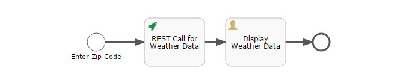

If you've ever designed a workflow you'll know that one of the most common requirements is to integrate various, disparate systems. To make this a little easier, the folks at Activiti created a REST Call Task to integrate simple RESTful service calls into a workflow without writing any code. The video below gives a demonstration on how to build a workflow using the REST Call Task to integrate with a third party web service (in this case, a public weather API).



To use this sample workflow in your own system you need to do the following.

* Set up a local instance of Activiti Enterprise. If you don't have a copy, download the trial here: &nbsp;<a href="https://www.alfresco.com/products/activiti/trial">Activiti Enterprise Trial</a>. 
* Create an Endpoint. Please note that the Path includes a key value (ab0b268232a61a53) that is for demonstration purposes only. You can create your own at <a href="http://api.wunderground.com" target="_blank">api.wunderground.com</a>.
```
Name: Weather Service
Protocol: HTTP
Host: api.wunderground.com
Path: /api/ab0b268232a61a53/conditions/q
```
* Import the App. You can download it here:
    	{}Get Weather By Zip Code App{}.&nbsp;If you created an Endpoint with the name 'Weather Service' everything should be okay. If you used a different name, you'll have to select the appropriate endpoint in the REST Call Task.
* Publish the App and add it to your dashboard.
* Try it out!


If you have any questions, feel free to reach out to me.
