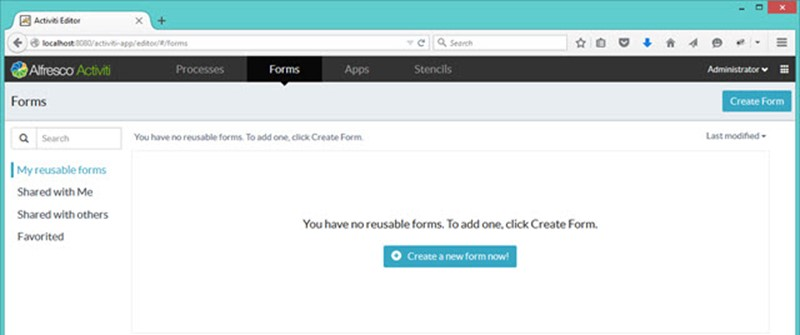
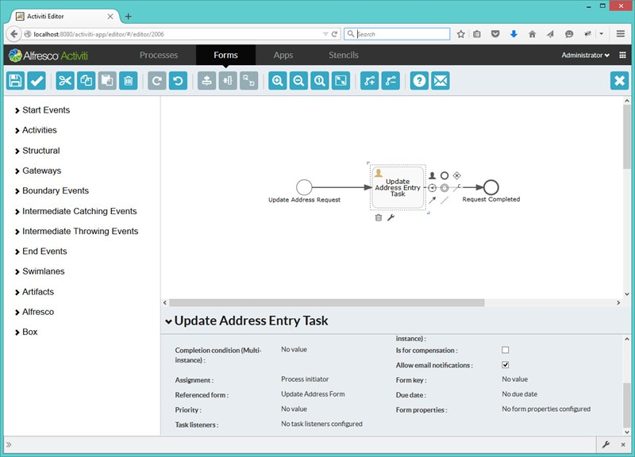
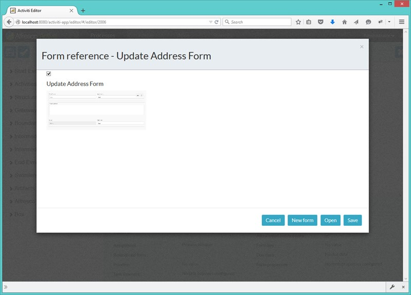
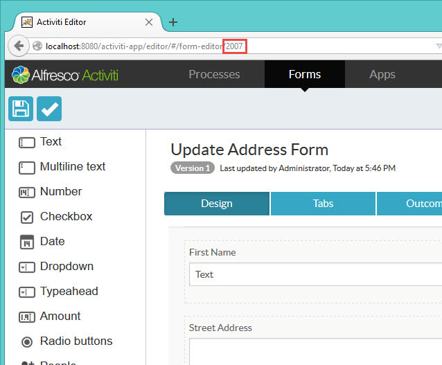
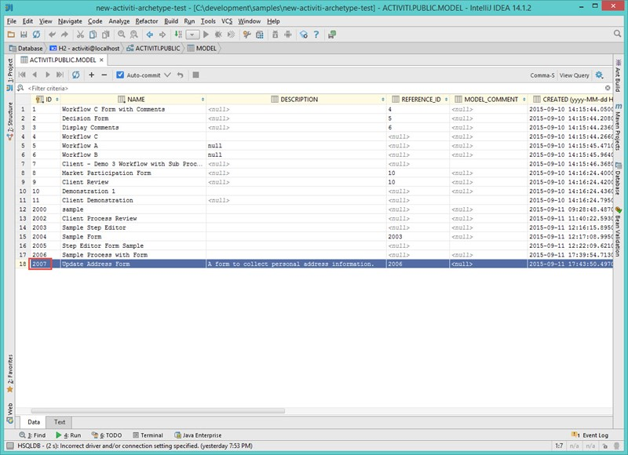
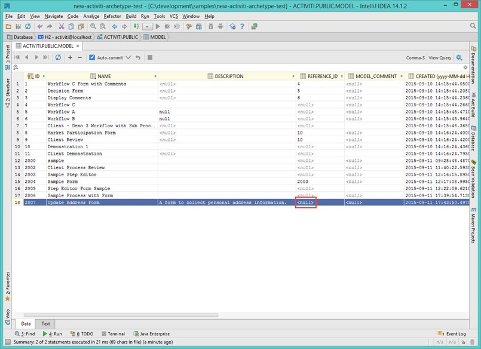
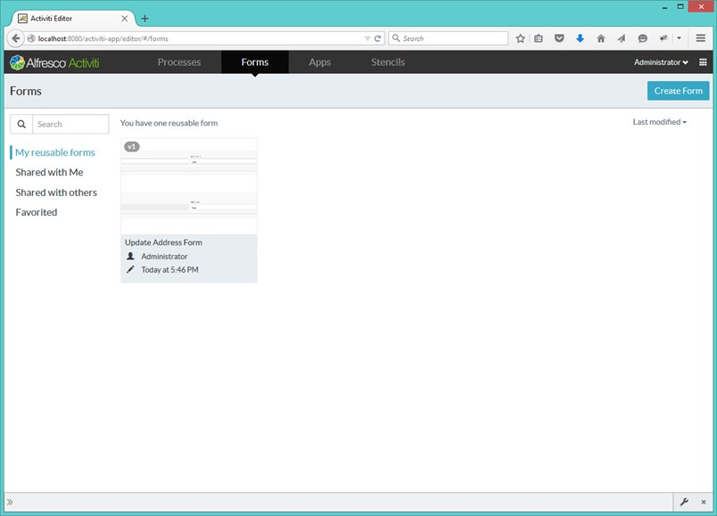

If you have ever created a process in the Activiti Enterprise BPM Suite, you have probably created forms within that process. If so, you may have run into that painful moment when you realize that the form you built within the process is not reusable to other processes. Luckily, there is an easy remedy, with a little tinkering in the database.

<strong>PLEASE NOTE: This is a useful hack, but a hack nonetheless. Please do not consider this a best practice.&nbsp;You should make every effort&nbsp;to avoid making direct database modifications.</strong>

In short, you need to do the following:
<ol>
 	<li>Find the Form ID, available in the URL address bar on the form page.</li>
 	<li>Find the row in the Activiti 'MODEL' table with that Form ID value in the ID field.</li>
 	<li>Replace the value in the 'REFERENCE_ID' field with a null value.</li>
</ol>
For more detail, I've included a step by step guide.
<h3>Find the Form ID</h3>
Within the process definition, select the task with the desired form. Select the 'Referenced form' value. In this example it is named 'Update Address Form'.

Click the 'Open' button.

The form will open on your screen. Look at the browser's URL address bar. Take a note of the last part of the URL. It is the form's ID.

<h3>Find the Row in the MODEL Table in the Activiti Database</h3>
Next, open the Activiti database's 'MODEL' table. Find the record with a matching ID (in this case '2007'). You'll notice a value in the 'REFERENCE_ID' field. This is the ID of the process model to which the form is currently associated. That process model is also in this table and can be seen with the ID 2006.

<h3>Update the Database</h3>
Remove the value in the REFERENCE_ID field for your form, leaving a null value in its place. Please note that modifying any system's underlying database comes with some risk. You should understand databases systems if you are going to make this change, and ideally, be in a development environment.

That's it! Now, if you navigate to the Forms page in the Kickstart app you will see your form listed as a reusable form.

